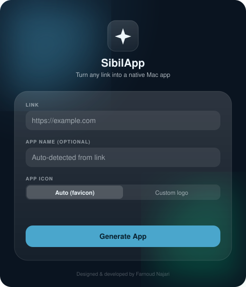

<div align="center">

# SibilApp

**Turn any link into a native Mac app.**



</div>

## What it does

SibilApp is a tiny macOS utility that wraps any website in a standalone,
double-clickable `.app`. Paste a link, optionally name it and pick an icon,
and SibilApp generates a self-contained native app on your Desktop — signed
and ready to run.

- **No browser chrome** — each generated app opens in its own window, backed
  by `WKWebView` (the same engine as Safari).
- **Custom icon, your way** — auto-fetch the site's favicon, or upload your
  own logo.
- **Self-contained output** — every generated app is independent; move it
  into `/Applications`, share it, or delete it freely.
- **Native UI** — SibilApp's own interface uses macOS's Liquid Glass design
  language (macOS 26+).

## Requirements

- macOS 14 or later to *run* generated apps.
- macOS 26 (Tahoe) + Xcode 26 or later to *build* SibilApp itself (for the
  Liquid Glass UI). A minimal fallback style is used automatically on older
  systems.
- Swift 6 toolchain (ships with Xcode).

## Building

```bash
git clone https://github.com/tashitushe/SibilApp.git
cd SibilApp
./build.sh
```

This produces `dist/SibilApp.app`, ready to run. Copy it wherever you like
(e.g. `/Applications` or your Desktop).

## Usage

1. Open **SibilApp**.
2. Paste a link (e.g. `https://mail.google.com`).
3. Optionally set a custom name, and choose how the app icon is sourced:
   - **Auto (favicon)** — fetched from the site automatically.
   - **Custom logo** — pick any image file from disk.
4. Click **Generate App**. A finished `.app` appears on your Desktop and
   Finder reveals it automatically.

## How it works

SibilApp ships a compact, pre-built runtime (`Template.app`) — a `WKWebView`
window that reads its target URL and title from a small `config.json` at
launch. Generating an app is just:

1. Copy `Template.app` to a new name.
2. Write the target URL/title into `Contents/Resources/config.json`.
3. Patch `Contents/Info.plist` (name, bundle identifier).
4. Build `Contents/Resources/AppIcon.icns` from the chosen favicon or logo
   (via `sips` + `iconutil`).
5. Ad-hoc code-sign the result (`codesign --sign -`) so Gatekeeper doesn't
   complain on the machine that built it.

No project templates are compiled per app — copying and patching a bundle
is enough, which is what keeps generation fast and the whole tool dependency-free.

> Ad-hoc signing is meant for local use. To share a generated app with other
> people without a Gatekeeper warning, re-sign it with your own
> **Developer ID Application** certificate and notarize it.

## Project layout

```
Generator/   SwiftUI app — the SibilApp UI and generation logic
Template/    Minimal WKWebView runtime bundled into every generated app
assets/      Icon source art + icon-generation scripts
build.sh     Builds both targets and assembles dist/SibilApp.app
```

## License

MIT — see [LICENSE](LICENSE).

---

<div align="center">
<sub>Designed & developed by Farnoud Najari</sub>
</div>
